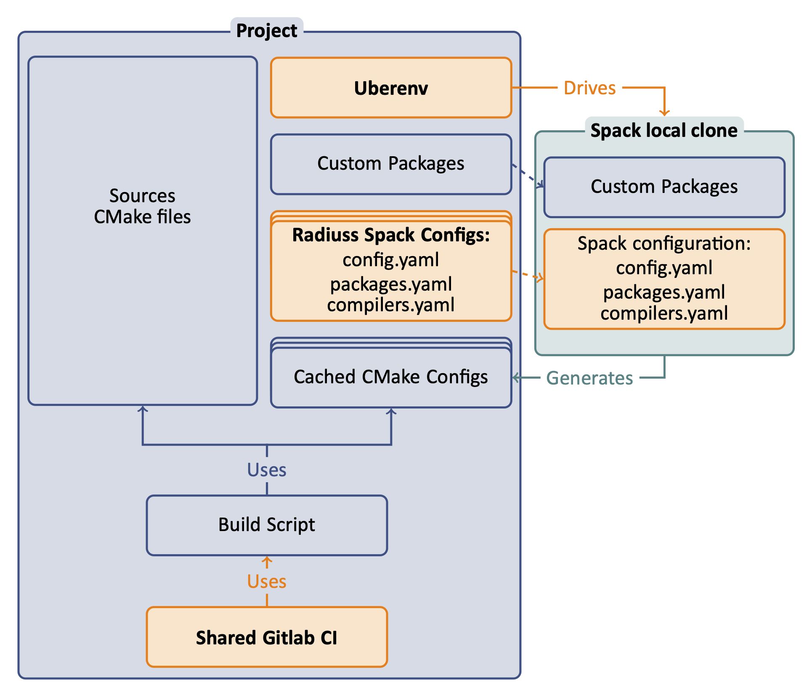

.. ##
.. ## Copyright (c) 2022, Lawrence Livermore National Security, LLC and
.. ## other RADIUSS Project Developers. See the top-level COPYRIGHT file for details.
.. ##
.. ## SPDX-License-Identifier: (MIT)
.. ##

.. _use_spack-label:

****************************************
Use Spack to configure the project build
****************************************

The first step in adopting RADIUSS CI infrastructure is to setup your project
so that Spack can be used to install the dependencies and generate a
configuration file for the build.

The end product should be a script that takes a Spack spec as an input, and
returns the configuration file generated by Spack after installing the
dependencies for the given spec.

Spack provides a common context to express *toolchains*, *machines setup* and
*build sequence*. It is increasingly used to install the dependency tree of
large simulation codes. As such, it makes sense to use Spack early in the
development process.

.. note::
   We are not promoting a "Spack everywhere" strategy. But we advocate that
   Spack should be *one of the ways* to configure and build your projects,
   since you projects will likely be built that way in production someday.

Using Spack will allow us to share configuration files to describe the
toolchains and machines setup. `Radiuss-Spack-Configs`_ is the repository where
RADIUSS projects Spack configuration is shared.

We rely on `Uberenv`_ to facilitate the setup of a local and isolated spack
instance that will be used to build the project dependencies. We strongly
suggest to start with Uberenv to keep the configuration script simple.

=============
Uberenv Guide
=============

This documents the setup and usage of Uberenv.

Uberenv can be used to generate custom host-config files, driven by a Spack
spec. This host-config file will point to the dependencies installed with Spack,
making the build process of the project straightforward.

Getting Started
===============

Here are some preliminary steps to follow to setup Uberenv, depending on how you
get Uberenv.

Getting Uberenv by clone/fetch/copy
-----------------------------------

1. Get uberenv.py script.

    Clone/Fetch/Copy it from `LLNL/uberenv <https://github.com/LLNL/uberenv>`_
    into a ``uberenv`` directory, not as a submodule.

2. Edit uberenv/project.json.

    Set your project package name, and other parameters like Spack reference
    commit/tag (we suggest the latest release tag).

3. Add radiuss-spack-configs submodule.

    * Use ``git submodule add`` to get `radiuss-spack-config
      <https://github.com/LLNL/radiuss-spack-config>`_.

    * Create a symlink ``uberenv/spack_configs`` that points to
      ``radiuss-spack-configs``.

4. Add custom packages.

    | If you need to make local modifications to your project package or a
      dependency package, you may put it in a corresponding directory:
    | ``uberenv/packages/<package_name>/package.py``.

5. Make sure that <project>/package.py generates a host-config cmake file.

    This is usually done adding a specific stage to the package (see for example
    the hostconfig stage in Umpire, CHAI, etc.).

Getting Uberenv as a submodule
------------------------------

1. Get uberenv.py script.

    Use ``git submodule add`` to get `uberenv
    <https://github.com/LLNL/uberenv>`_ into a ``uberenv`` directory.

2. Edit .uberenv.json.

    Create ``.uberenv.json`` in a directory that is a parent of ``uberenv``. Set
    your project package name, and other parameters like Spack reference
    commit/tag (we suggest the latest release tag).

3. Add radiuss-spack-configs submodule.

    * Use ``git submodule add`` to get `Radiuss-Spack-Configs`_ in a second
      submodule or custom location.

    * In ``.uberenv.json`` set ``spack_configs_path`` to point to
      ``<some_path>/radiuss-spack-configs``.

4. Add custom packages.

    * | If you need to make local modifications to your project package or a
        dependency package, you may put it in a corresponding directory:
      | ``<some_path>/packages/<package_name>/package.py``.

    * In ``.uberenv.json`` set ``spack_packages_path`` to point to
      ``<some_path>/packages``

5. Make sure that <project>/package.py generates a host-config cmake file.

    This is usually done adding a specific stage to the package (see for example
    the hostconfig stage in Umpire, CHAI, etc.).

Generating <Project> host-config files
======================================

This mechanism will generate a cmake configuration file that reproduces the
configuration `Spack <https://github.com/spack/spack>`_ would have generated in
the same context. It contains all the information necessary to build <Project>
with the described toolchain.

In particular, the host-config file will setup:

* flags corresponding with the target required (Release, Debug).
* compilers path, and other toolkits (cuda if required), etc.
* paths to installed dependencies.

This provides an easy way to build <Project> based on `Spack
<https://github.com/spack/spack>`_ and encapsulated in `Uberenv
<https://github.com/LLNL/uberenv>`_.

Uberenv role
------------

Uberenv helps by doing the following:

* Pulls a blessed version of Spack locally.
* If you are on a known operating system (like TOSS3), we have defined compilers
  and system packages so you don't have to rebuild the world, _e.g._ CMake, or
  MPI.
* Overrides <Project> Spack packages with the local ones if any. (see
  ``scripts/uberenv/packages``).
* Covers both dependencies and project build in one command.

Uberenv will create a directory ``uberenv_libs`` containing a Spack instance
with the required <Project> dependencies installed. It then generates a
host-config file (``<config_dependent_name>.cmake``) at the root of <Project>
repository.

.. note::
  One common source of error when using Uberenv is that the ``uberenv_libs``
  folder is out of date. To resolve, make sure this folder is deleted before
  running new scripts for the first time because this folder needs to be
  regenerated.

Preliminary actions
-------------------

Machine specific configuration
^^^^^^^^^^^^^^^^^^^^^^^^^^^^^^

Depending on the machine/system, <Project> may or may not provide a spack
configuration allowing to use uberenv right away.

Check in the machines/systems supported in ``scripts/uberenv/spack_configs``.
Per machine, <Project> will provide ``compilers.yaml``, ``packages.yaml``, and
``config.yaml``. The latter being possibly shared with other machines/systems.

Vetted specs
^^^^^^^^^^^^

Then, one can easily check what specs are tested in CI. For example, when
looking for the gcc versions tested on quartz:

.. code-block:: bash

  git grep "SPEC" .gitlab/quartz-jobs.yml | grep "gcc"

MacOS case
^^^^^^^^^^

It is not trivial to provide a universal configuration for MacOS.  Instead, the
developper will likely have to complete the ``packages.yaml`` file in order to
adapt the location and version of externally installed dependencies.

Using Uberenv to generate the host-config file
----------------------------------------------

.. code-block:: bash

  $ python scripts/uberenv/uberenv.py

.. note::
  On LC machines, it is good practice to do the build step in parallel on a
  compute node. Here is an example command: ``srun -ppdebug -N1 --exclusive
  python scripts/uberenv/uberenv.py``

Unless otherwise specified Spack will default to a compiler. It is recommended
to specify which compiler to use: add the compiler spec to the ``--spec=``
Uberenv command line option.

On blessed systems, compiler specs can be found in the Spack compiler files in
our repository: ``scripts/uberenv/spack_configs/<system type>/compilers.yaml``.

Some options
^^^^^^^^^^^^

We already explained ``--spec=`` above:

* ``--spec=%clang@9.0.0``
* ``--spec=%clang@8.0.1+cuda``

The directory that will hold the Spack instance and the installations can also
be customized with ``--prefix=``:

* ``--prefix=<Path to uberenv build directory (defaults to ./uberenv_libs)>``

Building dependencies can take a long time. If you already have a Spack instance
you would like to reuse (in supplement of the local one managed by Uberenv), you
can do so with the ``--upstream=`` option:

* ``--upstream=<path_to_my_spack>/opt/spack ...``

.. _Radiuss-Spack-Configs: https://github.com/LLNL/radiuss-spack-configs
.. _Uberenv: https://github.com/LLNL/uberenv
